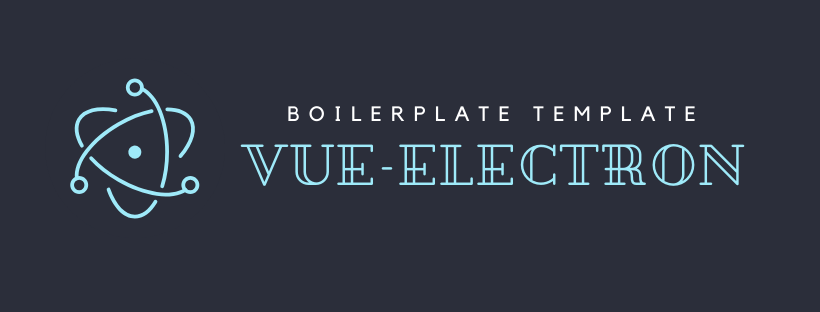

<p align="center">
  
</p>

<p align="center">
  A complete VueJS/Vuex Electron Boilerplate with predefined settings for automatic updates, and cross-platform availability and much more
</p>

<p align="center">
  
  
  
  
  
</p>       
         
<br/><br/><br/>

> Simplicity is the first step of nature, and the last step of art , by James Bailey


# 👨‍💻 *Technologies*
*List of technologies used for the VueJS Electron Boilerplate project.*


## 📦 Framework & Tools Used
- [x] *[vuejs](https://vuejs.org/v2/guide/) is a progressive framework for building user interfaces.*
- [x] *[vue-hooks](https://github.com/u3u/vue-hooks)⚡️Awesome Vue Hooks.*
- [x] *[vuejs composition api](https://vue-composition-api-rfc.netlify.com/) a set of additive, function-based APIs that allow flexible composition of component logic.*
- [x] *[electronjs](https://www.electronjs.org/) Electron is a framework for creating native applications with web technologies like JavaScript, HTML, and CSS.*
- [x] *[Vue CLI Plugin Electron Builder](https://github.com/SimulatedGREG/electron-vue) An Electron & Vue.js quick start boilerplate with vue-cli scaffolding, common Vue plugins, electron-packager/electron-builder, unit/e2e testing, vue-devtools, and webpack*
- [x] *[electron-updater](https://www.npmjs.com/package/electron-updater) This module allows you to automatically update your application. You only need to install this module and write two lines of code! To publish your updates you just need simple file hosting, it does not require a dedicated server.*
- [x] *[electron-icon-builder](https://www.npmjs.com/package/electron-icon-builder) An icon generator to generate all the icon files needed for electron packaging*
- [x] *[adblocker-electron](https://www.npmjs.com/package/@cliqz/adblocker-electron) Electron Adblocker*


## **:wrench: Developer usage**

### **Set up project**

Before cloning the repo **be sure** you have installed:

- [**NODE**](https://www.google.com/search?q=how+to+install+node) (version >= 10.16.x)
- [**NPM**](https://www.google.com/search?q=how+to+install+npm) (version >= 6.9.x)

Then:

- Choose a folder project in your system and switch in `cd [folder path]`
- Clone the repo in your folder path `git clone https://github.com/ChrisMichaelPerezSantiago/vue-electron-boilerplate.git`

---

### **Installation**

In order to install the project and all dependencies, enter in the project folder and run `npm install`

---

# vue.config.js
Predefined settings for windows, but can be configured for other platforms.


In the **publish** section you should change:

- [x] The value of the `owner` property to the username you use on github.
- [x] The property value `repo` repository name on github.

and make value changes in the properties `appId`, and `productName`.

to see available options, check out [Electron Builder Configuration Options](https://www.electron.build/configuration/configuration)


```javascript
module.exports = {
  productionSourceMap: false,
  pluginOptions: {
    electronBuilder: {
      builderOptions: {
        appId: "com.vue-electron-boilerplate.app",
        productName: "vue-electron-boilerplate",
        win: {
          icon: "src/assets/logo.png",
          target: [
            {
              target: "nsis",
              arch: ["x64", "ia32"]
            }
          ]
        },
        nsis:{
          oneClick: false,
          perMachine: true,
          allowToChangeInstallationDirectory: true
        },
        publish: [
          {
            provider: "github",
            owner: "ChrisMichaelPerezSantiago",
            repo: "vue-electron-boilerplate",
            releaseType: "draft",
          }
        ]
      }
    }
  }
}
```

# GH_TOKEN
You should assign an environment variable called `GH_TOKEN` with the token that github provides you. This is mandatory as it will help to apply automatic updates. For more information visit the [Auto Update](https://www.electron.build/auto-update) section for more details.


# How to release the application to github?
- [x] First, you must generate the icons that will be used as the logo of the executable icon and the application installation process.

Before generating the icons you should go to the **package.json** and change the `--input` path  where the icon is located

```json
"electron:generate-icons": "electron-icon-builder --input=./src/assets/logo.png --output=build --flatten"
```

then ...

```shell
npm run electron:generate-icons
```

- [x] Second, you should create the environment variable named `GH_TOKEN` and assign the value of the token that github provides you.


- [x] Then with the following command

```shell
npm run gh-publish GH_TOKEN
```

It will perform the build of the application and the release as draf. Now you should go to the repository and you will see that a release draf has created for you.


This is very useful because now the user should not go to the release section to download the new release of the application. It would only be enough to enter the application, and if there is a new version windows will show a notification to perform the update.


##  **Donations**
VueJS Electron Boilerplate is an open source project licensed by MIT with continuous development. If you want me to continue maintaining this library and you are interested in continuing to use it, you can help me with a monetary help in the following link:


- [One-time donation via PayPal.](https://paypal.me/chrismperezsantiago?locale.x=en_US)

<a href="https://www.buymeacoffee.com/chrismichael" target="_blank"></a>

These are projects that take a lot of effort and time to maintain. So with your help I will be more motivated to continue maintaining the VueJS Electron Boilerplate project.


## **:handshake: Contributing**

- Fork it!
- Create your feature branch: `git checkout -b my-new-feature`
- Commit your changes: `git commit -am 'Add some feature'`
- Push to the branch: `git push origin my-new-feature`
- Submit a pull request

---

### **:busts_in_silhouette: Credits**

- [Chris Michael](https://github.com/ChrisMichaelPerezSantiago) (Project Leader, and Developer)

---

### **:anger: Troubleshootings**

This is just a personal project created for study / demonstration purpose and to simplify my working life, it may or may
not be a good fit for your project(s).

---

### **:heart: Show your support**

Please :star: this repository if you like it or this project helped you!\
Feel free to open issues or submit pull-requests to help me improving my work.


---


### **:robot: Author**

_*Chris Michael*_

> You can follow me on
[github](https://github.com/ChrisMichaelPerezSantiago)&nbsp;&middot;&nbsp;[twitter](https://twitter.com/Chris5855M)

---

Copyright © 2020 [vue-electron-boilerplate](https://github.com/ChrisMichaelPerezSantiago/vue-electron-boilerplate).
